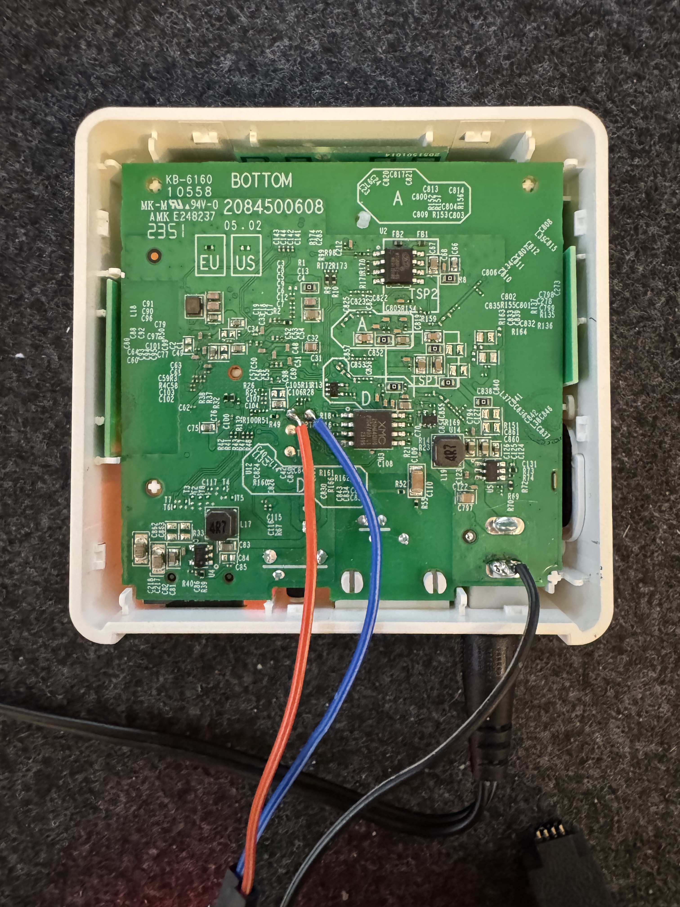

# Tapo DS230 local ring
Since the DS230 only works with the Tapo H200 Hub, it is not possible to interact with it directly. So all tools I found, do not work with the DS230, to get notified when the doorbell rings locally.

## Current solution

### ESP8266 Firmware
The firmware is as simple as it gets. It just connects to wifi and mqtt as well as to the serial interface of the hub. It then listens for the debug messages from the hub and sends a mqtt message when a "event" is detected.


* Black cable: GND
* Blue cable: TX (so RX on the ESP / FTDI)
* Orange cable: most likely RX (so TX on the ESP / FTDI)
* TP4 is 3.3V (not needed)
* TP3 is GND (use the GND from the power supply. It is easier to connect and more stable)

#### Limitations
In the short amount of time I had until now, I was unable to get the serial communication to work from the ESP / FTDI to the H200. I am pretty sure I got the right test point, but maybe RX is disabled on the H200 or a jumper needs to be soldered. If you know more about this, please let me know.

## Different approach
I also have a python script running using pytapo to request the ringstate every second. However, this script is not very reliable, since the connection sometimes times out (event over ethernet) or it is simply not working.

## Future
I asked TP-Link if they would open the API for the hub, to get local access to the Hub and connected DS230 or other devices. They said, that this is **not** planned. Integration of the DS230 into Matter is also **not** planned.
Since they recently again changed their authentication method, I dont think TP-Link is very interested in opening their API and working with the users to get them local access.

So I already have a firmware dump of 2 firmware versions. My plan is to reverse engineer the firmware and find a way to open the API so I can get not only the ring state, but also a live feed of the video.
It seems like they are using a modified version of OpenWRT, so it might be possible that TP-Link is just communicating with Ethernet Protocols between the hub and connected cameras. So maybe a routing table or something similar can be changed to open these devices to the local network directly and let the hub act only as a router.

## Firmware Dumps
The firmware can be downloaded from TP-Link's servers. However it seems to be encrypted.
Using a CH341A programmer, I was able to dump the firmware from the chip directly.
Due to legal reasons, I cannot provide the firmware dumps here.

I used this command to dump the firmware from the hub:
```
flashrom -p ch341a_spi -c "XM25QH64C" -r backup.bin
```

## Contributions
Your help in this project is very welcome. If you have any information about the serial communication, the firmware or anything else, please let me know.